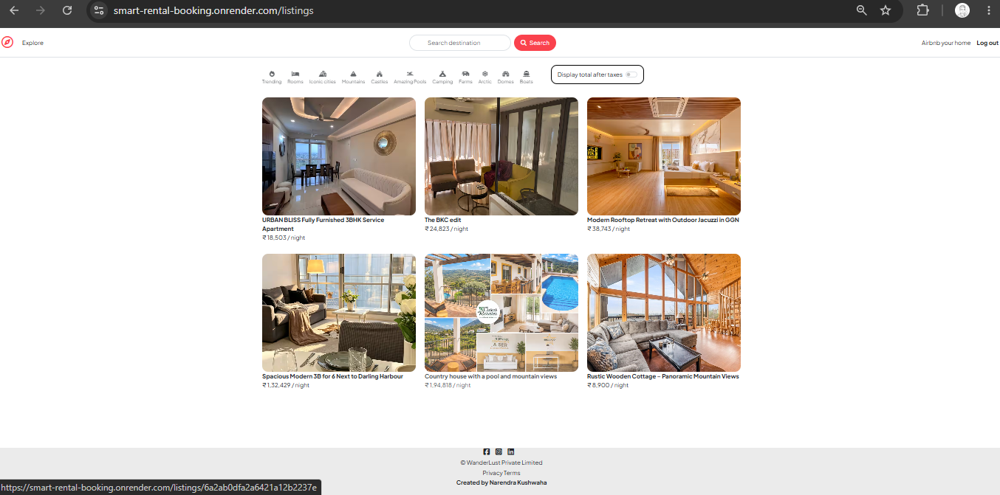
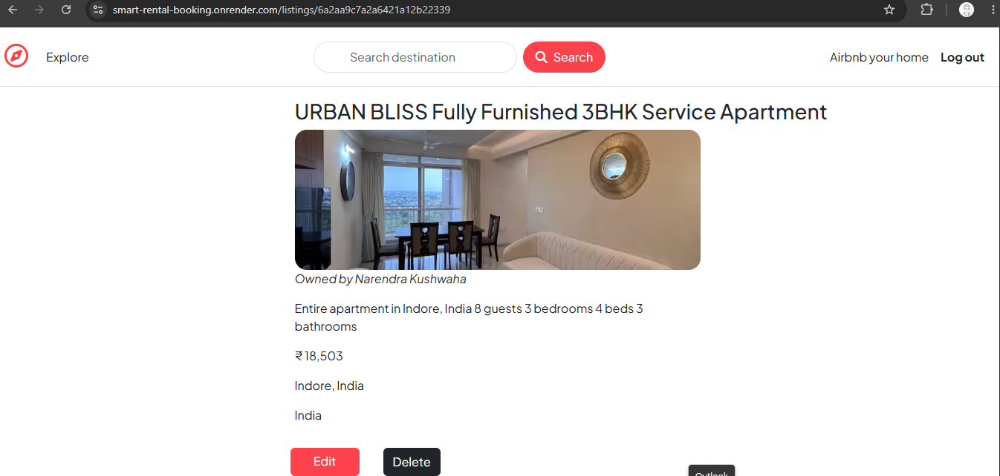
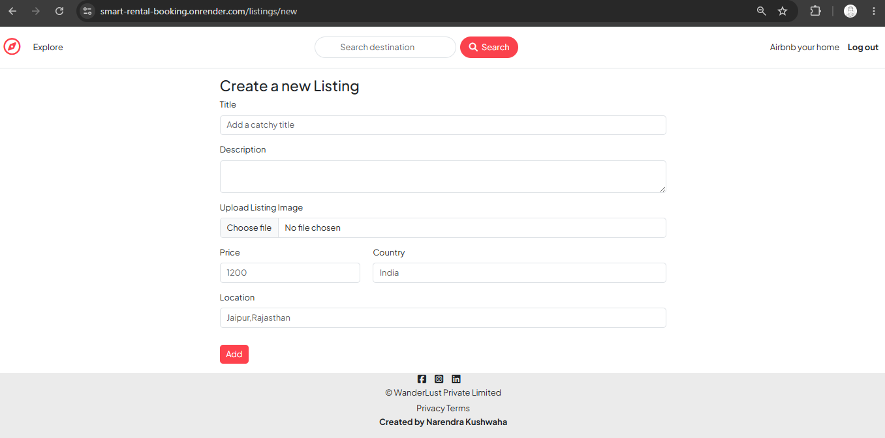
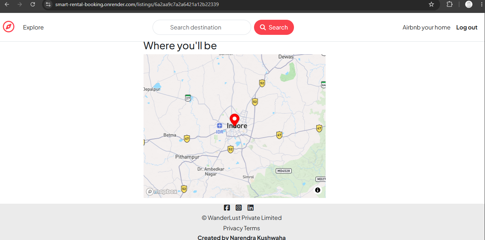
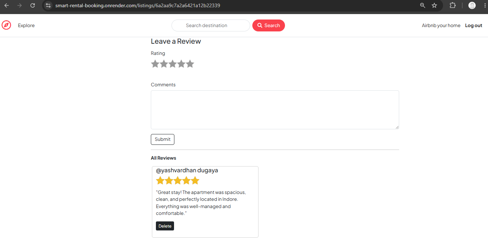

# Smart Rental Booking Platform 🏠

A smart rental platform developed as a final year team project.
Users can explore properties, view locations using maps, create accounts,
add property listings, and share reviews & comments.

## Features

- User Authentication (Login / Signup)
- Property Listing
- Add New Property
- Property Details Page
- Location Map Integration
- Reviews & Comments
- Responsive User Interface

## Tech Stack

### Frontend
- React.js
- JavaScript
- HTML5
- CSS3

### Backend
- Node.js
- Express.js

### Database
- MongoDB

## My Contribution

My main role was frontend development:
- Built responsive UI components
- Created reusable React components
- Designed user-friendly interfaces
- Worked on frontend integration with backend services

## Screenshots

## Live Demo

https://smart-rental-booking.onrender.com

## GitHub Repository

https://github.com/Narendra-kushwaha/smart-rental-booking

## 👨‍💻 Author

Narendra Kushwaha
